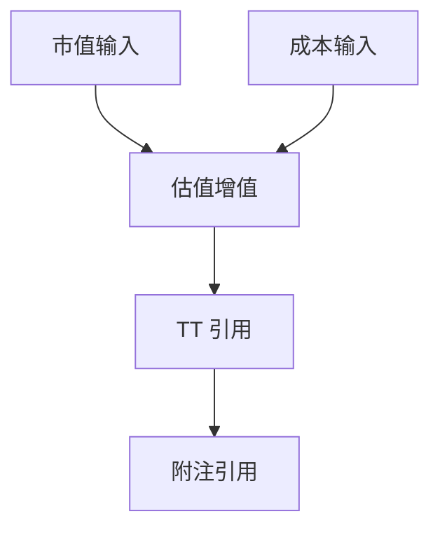

# 对外逻辑包数据契约

版本：0.1.0 · 草案 · 当前仅有结构样例，没有实际提取器。

## 1. 文件格式

小型项目使用 `logic-package.json`，格式由 [Schema](../schemas/logic-package.schema.json) 定义；完整虚构示例见 [synthetic-logic-package.json](../examples/synthetic-logic-package.json)。

大型项目计划使用 `manifest.json`、`nodes-0001.jsonl`、`edges-0001.jsonl` 等分片。分片版本、完整性校验和索引需要在大文件阶段新增独立 schema；当前 schema 仅适用于单 JSON 版本，不宣称已支持分片。

## 2. 关键字段

| 字段 | 含义 | 约束 |
| --- | --- | --- |
| `schema_version` | 契约版本 | 当前固定 `0.1.0` |
| `package_id` | 随机批次编号 | 不从公司、路径或文件内容直接编码 |
| `values_included` | 是否含真实业务值 | 固定为 false；技术常量不属于业务值 |
| `completeness` | 声明范围内是否完整 | complete 或 incomplete；仅描述结构覆盖，不代表业务结论 |
| `scope` | 导出范围说明 | 选定目标或整个项目，必须是通用表述 |
| `workbooks` | 匿名工作簿及工作表目录 | 只有别名和经确认的用途 |
| `nodes` | 输入、公式、区域、未知节点 | 没有 value、cached_value、raw_formula、path 等字段 |
| `edges` | 输入到结果的边 | direction 固定为数据来源 → 计算结果 |
| `parameters` | 被替换的业务常量 | 只保留编号、类型及角色 |
| `issues` | 无法完整处理的内容 | 匿名位置、固定错误代码及严重性 |

所有对象 `additionalProperties` 都为 false。即使字段存在于 schema，字符串内容仍需经过脱敏规则检查。

## 3. 节点与表达式

`input`：完成共享公式及数组/溢出区域归属检查后确认的值输入，不输出该值；不因邻行有公式就自动补造公式。计算归属存在但无法可靠解析时使用 `unknown`，不能降级成普通输入。

`formula`：含脱敏表达式、结构解析状态及语义确认状态。表达式由支持的安全语法树生成，引用用节点 ID，业务字面量用参数 ID。它是分析表达式，不是保证能够在 Excel 中直接执行的公式。

`range`：代表区域或整列潜在输入，避免展开大量值节点。第一版 schema 只记录区域地址；区域内部实际公式的索引与成员关系由本地引擎维护，若导出需要递归展开，必须把所需公式及边一起纳入范围。

`unknown`：保留未支持公式、动态目标或缺失外链的占位；原文不可经该节点带出。若目标无法定位，location 省略；节点编号仍稳定。

每条边包含引用依据：`direct`、`potential`、`dynamic` 或 `unresolved`。参考语法的绝对行列信息放在 reference 对象中；对区域可分别记录起止端点。静态名称或其他不适用的引用使用 `kind: name/other` 并省略不适用标志，不能随意赋默认 false。

公式内的节点/参数 ID 必须存在，依赖边端点必须存在。标记 `complete` 的包不能含 unknown 节点、dynamic/unresolved 边或未解决 issue；完整性仅针对声明的导出 scope。

## 4. 示例的业务含义

示例使用两项未知业务输入“市值”“成本”，计算“估值增值”，然后演示该结果被 TT 和附注单元格引用。

这是从零构造的关系示例，不是对用户实际底稿或 TT 定义的判断。

## 5. 外部模型分析约定

- 输出解释时引用节点 ID，并区分公式事实、字段含义与业务推测。
- 只使用包内提供的依赖；不要把字段同名认定为跨表关联。
- 遇到参数值未知，不推断实际是否超过阈值或是否勾稽一致。
- 遇到 incomplete，指出缺失节点如何影响结论。
- 模型返回内容在本地通过 ID 对照定位，不能把私人映射上传给模型。
- 模型输出不自动执行、不自动覆盖单元格，不将建议当作已完成的审计验证。

## 6. 本地分类与对外契约的映射

本地记录可保存 raw_value、cached_value、raw_formula、名称映射及来源版本，但这些字段不属于对外 DTO。内容来源、存储类型、业务标签分别保存，设计见 [分类方案](EXCEL_CLASSIFICATION.md)。当前对外 Schema 继续使用 0.1.0，不添加私有字段。

对外 data_type 是经检查的解释类型，不能直接照抄 OOXML 的 t 属性；共享字符串索引应先解码，日期需解释，无法判断时用 unknown。公式无缓存时不得伪造结果类型。数组/溢出区域的精细关系尚无专门 Schema：不能完整表达的导出范围以 unknown 和 incomplete 保留缺口，不额外塞入未定义字段。
